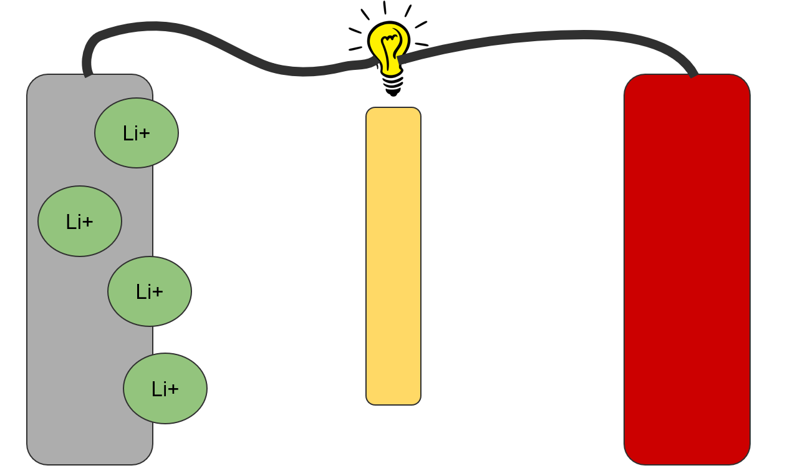
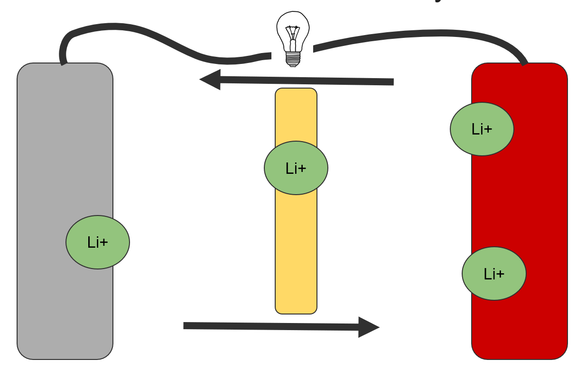
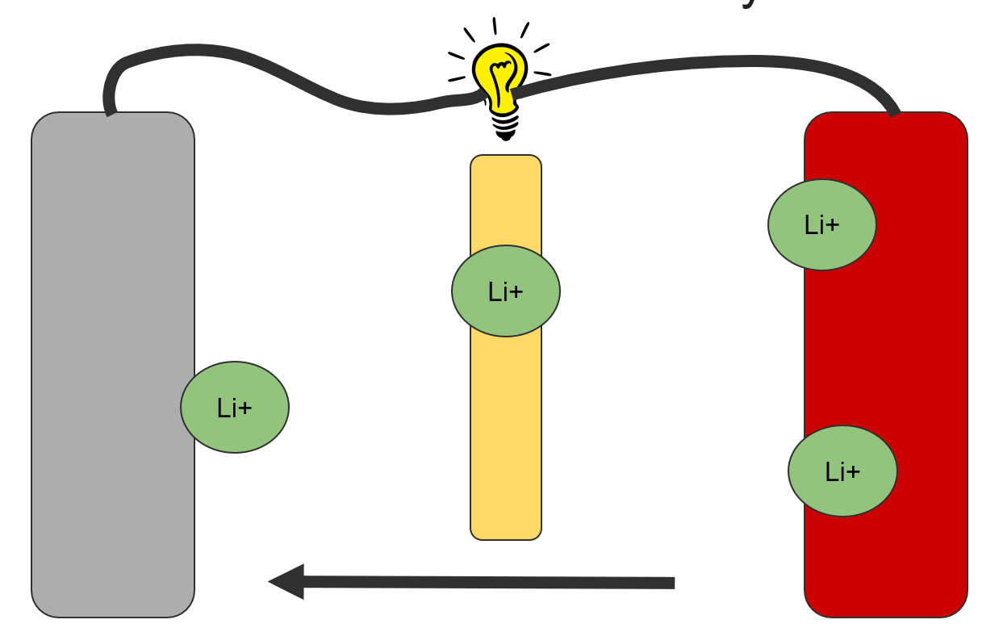
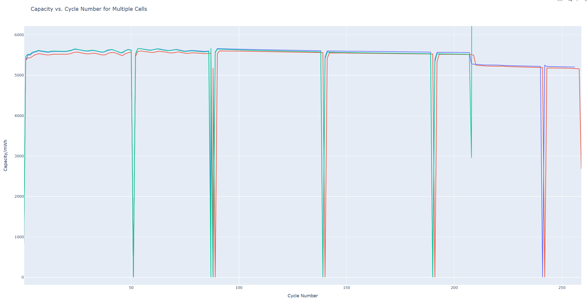
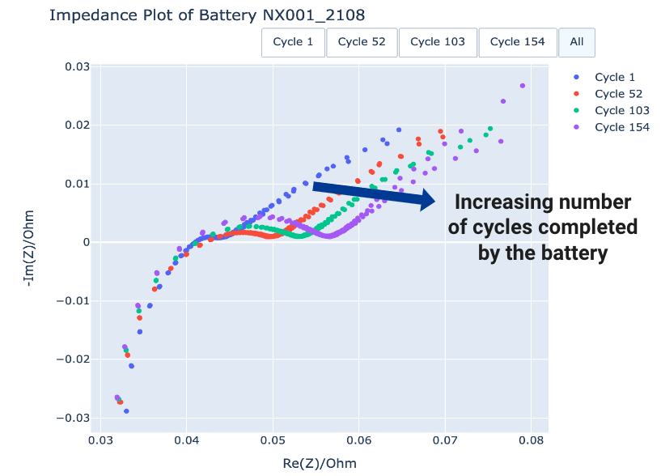
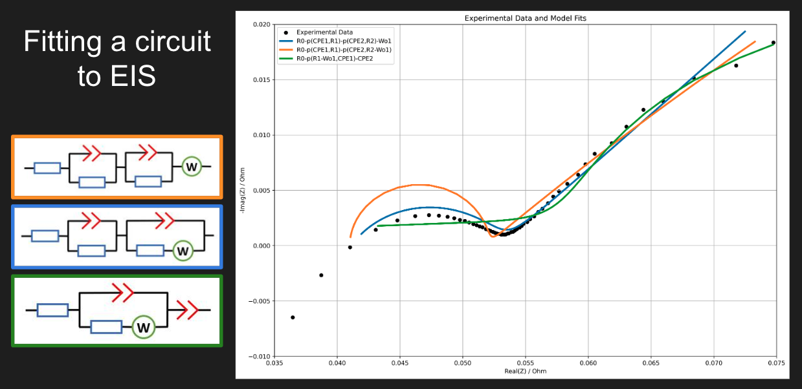
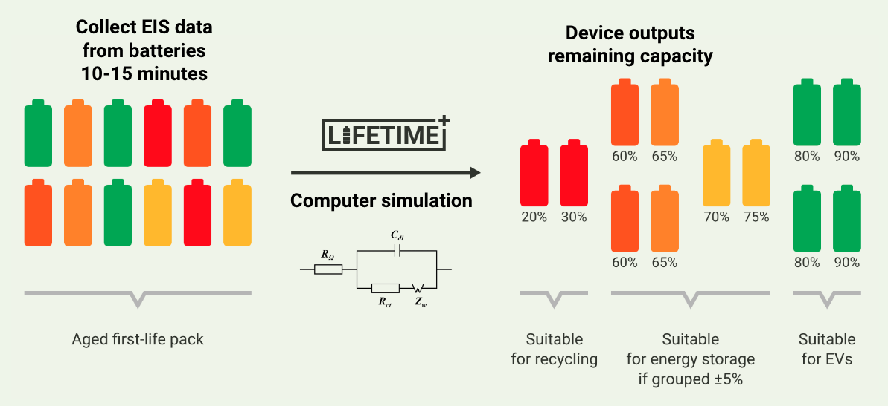
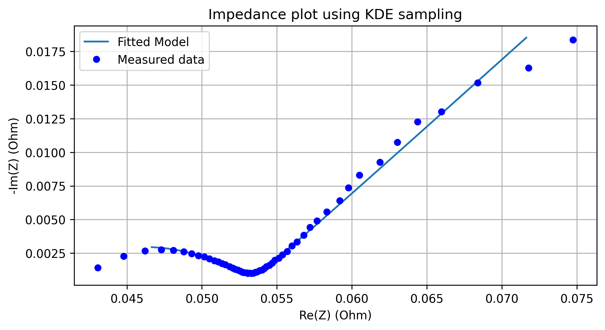

## Problem outline
We spent four weeks working alongside LiFETIME, a startup company looking to enable the second-life use of lithium-ion batteries. Currently, batteries, especially those used in EVs, are deemed to reach “end-of-life” (EOL) when their maximum battery capacity falls to 70-80% of their rated value. These EOL batteries are then sent to landfill or recycling centres, both of which have severe environmental impacts including waste accumulation, fire hazard, and toxic gas release. There is very little circularity in the industry, with just 5% of Lithium-ion batteries currently being recycled, while batteries that still have 70-80% capacity are prematurely discarded [^1].

LiFETIME are looking to provide a low-cost, open-source solution for cell health testing for second-life battery applications, in order to increase the life cycle of lithium-ion batteries. Essentially, they hope to provide a cheap device that will quickly measure how much future potential a battery still has left, allowing the operator to decide whether it can continue to be used, and in what environments it can be used. While they focus on the hardware of their design, we were tasked with investigating how to develop a model suitable for practical analysis of real-world cells. The brief was broad, with there being a plethora of methods of cell health analysis, so our first objective was to review existing literature on lithium-ion cell modelling, and better familiarise ourselves with the physics of battery degradation. Following a combination of discussion with LiFTIME and literature review we concluded that there were two potential routes we could pursue, either Electrochemical Impedance Spectroscopy (EIS), or Incremental Capacity Analysis (ICA). The team has collected sufficient primary data to allow us to follow either of these analysis techniques. Prior to our project, the data had not yet been used for any application other than for model validation. As the project progressed, we focused on analysing and visually presenting data, as well as fitting an equivalent circuit model to the EIS data, as is outlined in the technical overview.

## Importance and Value
The value of the product that LiFETIME is hoping to produce has the potential to be very high, as, inline with inclusive innovation practices and the sustainable development goals, it responds to a genuine need and adds significant value. With solar power and other less reliable renewable energy sources become more affordable and prevalent, the need for inexpensive energy storage is increasing. This is matched with the increase in battery use in the developed world, especially in EVs, and therefore we are seeing increased supply of these EOL batteries that still have 70-80% capacity. Second life batteries would enable stable electrification in areas that have unreliable energy supply, for example areas that rely on renewable energy sources or have unstable supply from another area. For example, in South Africa where scheduled power outages (‘load-shedding’) are a daily challenge, affordable batteries would give security to small business owners, allowing them to run internet, fridges, payment machines and keep their lights on. In rural areas where power supply is variable, second-life batteries could be used in hospitals to run oxygen concentrators or life support machines during outages or overnight. Increasing energy accessibility also enables alternative earnings, such as allowing crop farmers to run irrigation pumps powered by solar-battery systems for higher yield, and helps to reduce rural-urban developmental inequalities.

#### Alignment with SGDs and the UNICEF principles for Digital Development

We believe our work aligns with [UN Sustainable Development Goals](https://www.un.org/sustainabledevelopment/sustainable-development-goals/) 7 to 13 and inclusive innovation practices by responding to a genuine need for affordable energy storage and reduction of battery waste. 

Battery health assessment will enable a reuse economy for cells (**Goal 12**), lowering the economic barrier to access affordable and sustainable energy storage (**Goal 7**) and provide employment through resales and cell assessment technicians (**Goal 8**). The low-cost of second use cells also makes large-scale grid storage for renewables more feasible, and for low-cost, localised energy grids to be created. (**Goal 7**) This will reduce inequalities between urban/rural inequalities and the Global North/South (**Goal 10**) as well as providing stability to the electrical grid (**Goal 11**). As Amy highlighted in our final presentation, increased access to energy in rural areas could enable alternative earnings, enabling crop farmers to run irrigation pumps for higher yields. For regions where the energy supply is unstable such as South Africa, hospitals can now afford to run their essential and life-saving equipment such as oxygen concentrators through these outages. Currently, only larger and high margin businesses have been able to afford uninterruptable power supplies. With cheap 2nd life cells, small businesses will be able to continuously run refrigeration, payment terminals and other essentials. This addresses **goal 9**, the provision of resilient infrastructure.

Energy storage can help us meet **goals 12 and 13**, by reducing emissions and waste products associated with the production of energy and the manufacture of battery cells. With as much as 95% of cells being sent to landfill  [^2] and the world's capacity to produce cells expected to increase 6 times over in just a decade, the potential benefits are substantial. [^3]

This project also aligns with **UNICEF Digital Development Principles 6, 7 and 9**. We align with **principle 6** (Use of open data, open standards, open source and open innovation) by publishing the dataset we have used as well as our analysis and designed our software to be open source. The code is publicly available through GitHub. Our work has been completed with **principles 7** (reuse and improvement) and **9** (collaboration) by working together with LiFETIME on this project, through our use of freely available data analysis and plotting libraries throughout, a modular code design with functions that can be reused by other users and through our extensive documentation of our work, research and meetings in our GitHub commits, wiki and website.

## Technical overview

On the inside, a lithium ion battery has two plates that can hold Lithium ions. The middle layer acts like a sieve, allowing lithium ions to pass, but electricity can’t. When you charge it, the lithium ions move from one side to the other to equalize out the electricity you put in. 

When you discharge it, the opposite happens, but since the electricity can’t go through the battery, it goes through whatever you’re trying to power. The primary way lithium batteries lose capacity is when the lithium gets stuck. Different lithium batteries can have different materials used in them, giving them different properties, but they all fundamentally work the same way. 

LiFETIME ran a series of cells of through a cell cycler, charging and discharging them hundreds of times. We looked through this data, and we were able to determine how much capacity the cells lost over these cycles. Anomalies exist in the data because of the way the testing was performed, which more work is needed to filter out. There were two types of batteries, first Lithium phosphate cells, like those used in solar energy storage and off-grid living. They barely lose any of their capacity, even after 250+ cycles. These batteries are less common because they’re generally heavier and larger.[^4]

By contrast, the type of Lithium-cobalt cells used in your phone, laptop or car degrade pretty quickly. These cells were tested again 5 months later, and we saw that storing them charged in a box for a few months has severely degraded their capacity. Additionally, while the two cells that are identical to begin with, they degrade very differently over the same life. 

Further complicating things is voltage fade, where the cell voltage changes, reducing the amount of power it can output, and as a result it means we can measure capacity in two different ways, in mWh and mAh. [^5]

So why hasn’t the challenge of quick and cheap cell health test already been solved? The cycling data is expensive and there are only a few academic datasets available. Additionally, degradation is complex. It depends on charging and discharging speed and depth, temperature, cell chemistry and the time spent charged. As we saw with the lifetime data, it can be very different even for cells with identical lives. Futhermore, batteries degrade by many different modes and the suitable future life applications depend on the process by which it has begun to degrade. [^6], [^7]

An alternative is EIS, or electrochemical impedance spectroscopy, which is a measurement technique used by scientists to get information about the processes that are happening inside a battery. Different chemical reactions in the cell happen at different speeds, so if we run electricity through the battery at different speeds and take measurements, we can draw a plot, called a spectrum, that gives us a hint as to what is going on inside the cell, and this is what we want to take advantage of [^7]. Note, the shape of the graph changes with the capacity of the battery, as can be seen in the image below. When we measure the EIS for a new battery, we want to be able to use the graph to create a simulation of what’s happening inside the cell, as this means we can run tests on a computer instead of on a battery.

EIS takes less than 15 minutes to run, so it’s much more convenient than using cycle data, which can take hours or even days to record. And, as we’re not fully charging and discharging the battery each time, it saves energy too. Once you own the equipment to do the testing, we think it’s a much cheaper way to test cells. But how do we use the EIS graph to simulate what’s going on inside the battery? We create a model based on something we already know how to analyse… a circuit! We find an equivalent electronic circuit, with wires, resistors and capacitors, that we can simulate on a computer [^8]. We choose the components of the circuit so that the graph produced on a computer matches the graph produced when we run it on the real battery. Each component in the circuit relates to something physical inside the real battery. We had a go at fitting a circuit to our EIS data, and some circuits are a great fit, and some fit much less well, as can be seen in the image below. This is because of the different components used in the circuit model, and how well they relate to the aspects of the physical battery [^9]. 

The goal of our project was to take EIS data and try to find an equivalent circuit to match. The equivalent circuit model allows us to run tests on a computer without having to record more data from the physical battery. This will mean that a battery can have just one EIS test done using the LiFETIME device, taking as little as 10 or 15 minutes. Then, the computer will fit the EIS data to an electrical circuit model and runs analysis on the virtual circuit, which will give the results needed for the device to tell the user how much longer the battery can be expected to last, including information about parts of the battery that might be failing or fail next. 

One way we’re helping LiFETIME reach this end product is by reporting the challenges of fitting a circuit model to EIS data. One challenge is that a circuit that fits well for one battery chemistry does not fit well with other batteries, as you can see, the spectra shown on the slides have different shapes. Another challenge is the fact that EIS spectra are different for different states of charge: for example if you do the test when the battery is at 20% charge, you will get a different result to doing it say, at 50 or 80%. Additionally, there are lots of different software packages that can be used to do this fitting, so this is something else we’ve investigated for LiFETIME. Some software is very specific to EIS, while others have been created for general optimisation. First we tried Impedance.py [^10], a python package designed specifically for this purpose, which gave a great fit, but was extremely slow. Next we tried SciPy [^11], which was much quicker but worse fit, as the data in the middle of the plot is much more densely populated and is incorrectly weighting the result. We improved this plot with something called Kernel Density Estimation [^12]. The idea of this is to sample data points proportionally to how close together they are, and this resulted in an improved fit, which can be seen in the image below. This is all still a work in progress, but we can pass our findings back to LiFETIME so that they can continue with our work and improve on our analysis.

In summary, battery degradation is complex, and is affected by a number of different factors. The most common way of testing batteries is by cycling them over and over again, but we think EIS is a better way of testing cells, because it is quick and less costly. Once you have recorded EIS data, an equivalent circuit model enables a computer to predict how the batteries will behave in their future life. This has huge potential to reduce battery waste and provide affordable energy storage for all. We were honoured to join LiFETIME for four weeks to complete research into capacity analysis, EIS and equivalent circuit modelling, and we hope our findings will help LiFETIME as they develop their product.

## Reflection
### Statement from Joe:
Given the complexity and breadth of the project, I'm happy with the progress we made. Whilst it was tempting to want to create a "complete" model, it wasn't realistic given the time we had and how many researchers have tried and failed to achieve a complete model. We set out a series of realistic objectives (data analysis and assessing whether an EIS/ECM model was possible), modified them as we gathered new information and for the most part, stuck to the expected timeline. 

Whilst our research could have been better organised, needing significant "tidying up" throughout I'm particularly proud of how we laid out our meetings with LiFETIME. We formed a plan for the meeting beforehand, and split taking minutes vs engaging in discussion. After the meeting, all information was organised into the wiki, which saved a lot of time that would've been spent "chasing our tail" and correcting for what had been left out of the documentation from LiFETIME. I'm also proud of how much I've learned about the topic, and how much we were able to gather and synthesise from the reserach. With more time on this project, I feel that we could make a pretty substantial impact on the field.

LiFETIME supplied us with their previous work well after it would've proved useful. We had already stopped working on the bulk of the code and started final documentation by that stage. Whilst it's not the first time I've encountered issues with companies not maintaining proper documentation (as was the case with the data supplied and the methods used to gather it) and sharing information when it's too late to be useful, it is nonetheless frustrating and has left us feeling that our time could've been better spent. Our small team size was helpful, as we could work on the project together and discuss information as it was discovered or resolve issues together as they came up. A larger team would have required more administrative overhead, and would have impeded our "per-person" progress.

If I were to be critical of myself, I think that I underestimated how steep the learning curve would be, and how long analysing the data would take. Furthermore, whilst I was able to feed into the plan and research into the EIS and ECM modelling and her out where I could, Amy was mostly on her own when it came to the EIS and ECM analysis whilst I worked on the data analysis and organising the information we came across. Although, a counter argument to this would be if we didn't split our focus we would be left tripping over each other, and impeding each other's progress by working on the same task. Working on code that someone else has written can be difficult, and often leaves you making additional changes to suit your own preferences. Ultimately, there's no way of knowing which way would've given us the best results.

### Statement from Amy:
I think the team work strategy was effective, and I think we achieved some really interesting results and impressive progress in such a short time-frame. Meeting frequently with each other and the partners was crucial to our progress, as we learnt more when we shared our findings and found that talking to the LiFETIME team quickly solved many of our issues and gave us ideas to pursure. I enjoyed the challenge of taking on a share of the management roles required for the running of the project, however, I think some of these roles, such as the admin/ communications with the LiFETIME, perhaps could have been shared between us. We probably should've realised sooner that LiFETIME would have a GitHub and asked for it at the very start, and then when it wasn't shared immediately we definitely could have got the project leader involved (we weren't told about the LiFETIME GitHub, and when we did this to ask, we were only given access to the GitHub late into the project). Our progress was also slowed by our lack of background knowledge on the topic, but we worked hard to learn quickly. 

The brief was very broad, so perhaps a more specific and detailed brief would've been able to streamline our research and focus our direction, resulting in quicker progress. I'm glad I got the ball rolling quickly with the EIS analysis, where I picked up many new data analysis skills very quickly. I was slower in approaching the ECM analysis, which was due to my lack of intuition and understanding of electronic circuits, which I had to increase. Indeed, I think we could've got further with the ECM fitting and had more results to share with the team if the capacity analysis had been completed more quickly (or perhaps in less detail, once we had decided that it wasn't the route we were planning to pursue), allowing us to both focus on the EIS data and share the workload on the ECM analyis. Since Joe has a stronger electronics background, I imagine his support in this area would have been very helpful. We both worked incredibly hard on our separate areas towards the end of the project, and saw good results, but we may have lost out on the benefits of collaboration in this period.

# References
[^1]: BBC. (2021, April 27). Electric cars: What will happen to all the dead batteries? BBC News. [Link](https://www.bbc.co.uk/news/business-56806585)
[^2]: Brown M, Hilton M., Crosette S. et Al (2021). Cutting Lithium-Ion Battery Fires in the Waste Industry, Eunomia [Link](https://www.circularonline.co.uk/wp-content/uploads/2021/01/Waste-Fires-Caused-by-Li-ion-Batteries_v3.0.pdf)
[^3]: White House (US), (June 14, 2021). Estimated production capacity of tier 1 to 3 lithium-ion battery factories worldwide in 2018 with a forecast for 2023 and 2028 (in gigawatt hours) [Graph]. In Statista. Retrieved June 06, 2024, from (https://www.statista.com/statistics/1247625/global-production-capacity-of-lithium-ion-battery-factories/)
[^4]: Danae, Lithium Iron Phosphate vs Lithium Cobalt Oxide (2020), Grepow [Link]
[^5]: Chandan, P., Chang, CC., Yeh, KW. et al. Voltage fade mitigation in the cationic dominant lithium-rich NCM cathode. Commun Chem 2, 120 (2019). https://doi.org/10.1038/s42004-019-0223-3
[^6]: Edge, Jacqueline & O'Kane et Al. (2021). Lithium Ion Battery Degradation: What you need to know. Physical Chemistry Chemical Physics. 23. 10.1039/D1CP00359C
[^7]: Zhang, Han, et al. "BatteryML: An Open-source platform for Machine Learning on Battery Degradation." arXiv preprint arXiv:2310.14714 (2023).
[^8]: Westerhoff, U., Kurbach, K., Lienesch, F. & Kurrat, M., 2016. Analysis of Lithium-Ion Battery Models Based on Electrochemical Impedance Spectroscopy. Energy Technology, 4(12), pp.1620-1630. Available at: [Link](https://doi.org/10.1002/ente.201600154).
[^9]: Middlemiss LA, Rennie AJR, Sayers R, West AR. Characterisation of batteries by electrochemical impedance spectroscopy. Energy Reports. 2020;6(Suppl 5):232-41. doi: 10.1016/j.egyr.2020.03.029.
[^10]: Murbach MD, Gerwe B, Dawson-Elli N, Tsui LK. impedance.py: A Python package for electrochemical impedance analysis. Journal of Open Source Software. 2020;5(52):2349. https://doi.org/10.21105/joss.02349
[^11]: Pauli Virtanen, Ralf Gommers, Travis E. Oliphant, Matt Haberland, Tyler Reddy, David Cournapeau, Evgeni Burovski, Pearu Peterson, Warren Weckesser, Jonathan Bright, Stéfan J. van der Walt, Matthew Brett, Joshua Wilson, K. Jarrod Millman, Nikolay Mayorov, Andrew R. J. Nelson, Eric Jones, Robert Kern, Eric Larson, CJ Carey, İlhan Polat, Yu Feng, Eric W. Moore, Jake VanderPlas, Denis Laxalde, Josef Perktold, Robert Cimrman, Ian Henriksen, E.A. Quintero, Charles R Harris, Anne M. Archibald, Antônio H. Ribeiro, Fabian Pedregosa, Paul van Mulbregt, and SciPy 1.0 Contributors. (2020) SciPy 1.0: Fundamental Algorithms for Scientific Computing in Python. Nature Methods, 17(3), 261-272.
[^12]: Scikit-learn contributors. Kernel Density Estimation. [Online]. Available from: https://scikit-learn.org/dev/auto_examples/neighbors/plot_digits_kde_sampling.html [Accessed 2024 June 6].

